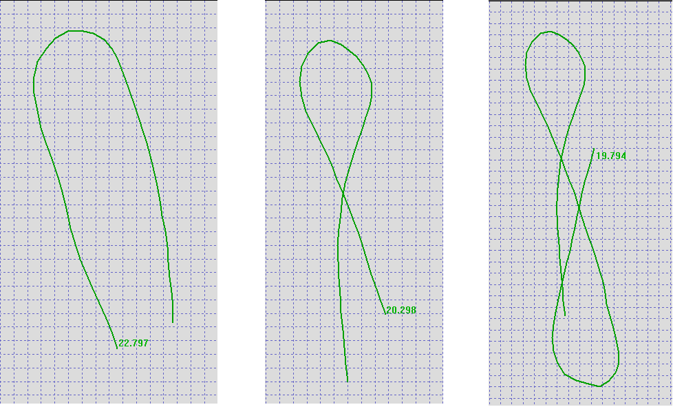
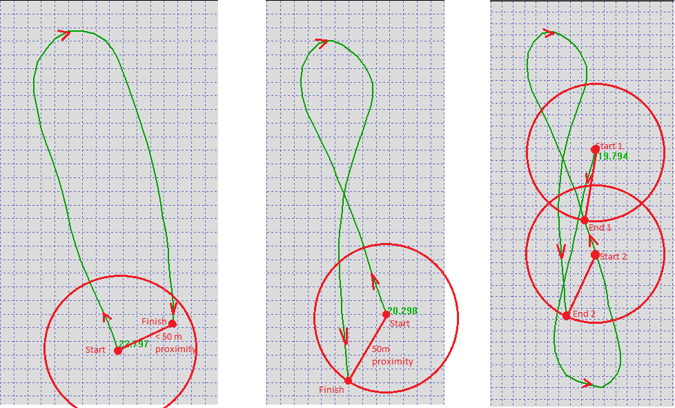

## Alpha Racing

### Background

Alpha racing is a merging of GPS technology with the natural back and forth sailing done by most sailboarders around the world. It uses the power of GPS and computing to calculate your best average speed from any point through a gybe and back to the same point.

There are only two rules in Alpha Racing:

1. **You must get back to a previous position**. Because it is not always easy to know exactly where you have been or on what line you sailed into the gibe, a tolerance needs to be applied in the calculations. The term for this tolerance is the Proximity Distance. 
1. **All results must have a total distance covered that is less than or equal to the maximum distance.** The software will only calculate results achieved where the total distance covered from start to return is less than or equal to the maximum distance.

Alpha 500 is the standard speed categories when speedsurfing, where the proximity distance is **50m** and the maximum distance covered is **500m**.

No other rules are necessary. As long as you are on a sailboard you can do whatever you like within these two constraints. You can gybe multiple times, you can cross your path multiple times, sail upwind and downwind,  you can even tack!

The original article describing alpha racing is no longer online but can be viewed on [Wayback Machine](https://web.archive.org/web/20130920105705/intellimass.com/RealSpeed/Alpha%20Racing.htm).

#### Example Alphas

The image below contains three examples of an alpha 500:

1. Typically, alpha 500s resemble a U shape so that the finishing speed is maximized after the gybe / turn.
2. However, crossing the original path is also perfectly acceptable as shown in the second example.
3. The third example illustrates two distinct alphas which actually overlap each other; i.e. second alpha starts before the first alpha ends.

#### Alpha Detection

There is no prescribed algorithm which says how to detect and calculate alpha results within software.

All that matters is that the **proximity distance** and **maximum distance** are accurately implemented; 50m and 500m respectively.

The examples from earlier have been annotated to show the significance of the 50m proximity rule.

### Implementation

#### General Principle

The general principle is for every reading from the GNSS receiver, look back over the previous 500m of readings for possible start points of an alpha.

Counting backwards over 500m is obviously straightforward (although it is definitely worth using a cache / buffer to facilitate less costly distance calculations) but proximity detection is where things become a little more complicated.

Failure to properly implement the proximity checks can lead to wildly inaccurate alpha results. For example, my APEX Pro reported 27.64 knots on 12 Nov 2021 but it was for a non-qualifying alpha attempt (> 50 m proximity) and the best alpha of the day was actually 21.15 knots.

Using a brute-force approach to determine the possible start points within a given proximity will be computational expensive and there are some major savings to be made through the use of a more intelligent algorithm. Computational costs can be reduced by orders of magnitude.

#### Proximity Detection

Proximity detection might appear to be an obvious application for the [Haversine formula](https://en.wikipedia.org/wiki/Haversine_formula) but it is overkill for alpha racing. Whilst the Haversine formula is essential during navigation and when calculating long distances between two points on a globe, it is not required for the alpha proximity detection.

This project includes a Python notebook called "[haversine_vs_pythagoras](https://github.com/Logiqx/gps-wizard/blob/main/python/haversine_vs_pythagoras.ipynb)" which assesses the accuracy of [Pythagorean theorem](https://en.wikipedia.org/wiki/Pythagorean_theorem) for the calculation of distances between two points around 50m apart, over the entire globe using 1 degree increments in latitude (-90° to + 90°) and longitude (-180° to +180°).

The results of this analysis show that Pythagoras is more than accurate enough at the latitudes which have ever been windsurfed and there is no need to implement the compute-intensive Haversine formula. Pythagoras produces sub-mm accuracy which is plenty good enough for 50m proximity detection!

#### One-Time Calculations

A big advantage of using Pythagoras instead of Haversine is that the number of relatively [costly trig functions](https://latkin.org/blog/2014/11/09/a-simple-benchmark-of-various-math-operations/) (e.g. sin, cos, asin) are reduced during each proximity calculation. These savings add up over time because the search for possible alphas needs to occur after every single GNSS reading.

However, this saving in itself is not the biggest advantage. The biggest advantage is that the only remaining trig functions (calculating the distance from east-west, per degree of longitude at a given latitude, using "cos") can be cached / buffered and only ever needs to be done once.

This has multiple advantages:

- Total compute costs are typically reduced by **one to two orders of magnitude**.
- All of the computations can be **evenly distributed** over time, avoiding particularly high computational spikes towards the end of alpha runs.
- Time required to analyze alphas in software is greatly reduced and is particularly useful for real-time calculations within a GPS watch.

#### Minimum Alpha Distance

Although not prescribed in the original definition of alpha racing, software such as [GPSResults](https://www.gps-speed.com/index.html) and the [GP3S](https://www.gps-speedsurfing.com/) website (including the COROS auto-sync) implement a "minimum alpha distance".

A distance of 250m has been chosen and it avoids some minor complexities / grey areas when identifying alpha results within software and also allows for a significant computational saving.

The minimum distance essentially allows the software to skip past the most recent 250m of readings and only consider the prior 250m of data when looking for the start of alpha 500s.

This typically reduces the number of proximity calculations / checks by around 30%.

#### Angular Differences

Since alphas are essentially a "there and back" (including a gybe / turn) it is useful to look at the differences in course over ground (COG) prior to calculating the proximity between two points.

A "safe" value to choose for the minimum required angular difference is 90°. This does not affect the alpha results produced but vastly reduces the number of proximity checks required when doing decent length runs.

In most cases, 120° will suffice but I have seen identified alpha runs where it is 115° an it is plausible that 90° could potentially be required, The gains from increasing the minimum angular difference further are very small, hence my choice of 90°.

Computational savings (reduced number of proximity checks) can be anywhere between 60% on a small lake and 85% on a large expanse of water.

### Computational Savings

Combined savings of the minimum distance (>= 250m) and required angular difference (>= 90°) range between 70% on a small lake to 90% on a large expanse of water However, these savings are purely related to the number of proximity checks / calculations being performed during the session.

In reality, proximity calculations using pre-cached figures along with Pythagoras will be more than an order of magnitude faster than the regular Haversine formula which is computationally costly and needs to be fully evaluated for each pair of potential start and end points.

Overall, the techniques described in this document will lead to compute costs that are at least **two orders of magnitude** lower than a brute-force Haversine approach and the computational load will be spread more evenly.

These savings make the approach described in this article perfect for real-time calculations within GPS watches such as the models produced by COROS.

All of the [sessions](https://github.com/Logiqx/gps-wizard/tree/main/sessions) below are available on GitHub and were used to test the results of these algorithms. The alpha results are consistent with GPSResults and the number of proximity checks has been measured for the various optimizations detailed in this article.

| Session                                                      | 20211020                                                   | 20211112                                                   | 20220404                                                    |
| ------------------------------------------------------------ | ---------------------------------------------------------- | ---------------------------------------------------------- | ----------------------------------------------------------- |
| Session summary                                              | Speed session in Portland Harbor; long runs and few turns. | Speed session in Portland Harbor; long runs and few turns. | Foiling session on a small lake; short runs and many turns. |
| # Track points                                               | 9,515                                                      | 3,275                                                      | 6,877                                                       |
| # Proximity tests without optimizations                      | 302,103                                                    | 132,046                                                    | 379,276                                                     |
| # Proximity tests with >= 250m minimum distance              | 135,388                                                    | 64,234                                                     | 165,170                                                     |
| # Proximity tests with >= 90° angular difference             | 41,647                                                     | 26,045                                                     | 161,046                                                     |
| # Proximity tests with >= 250m and >= 90° angular difference | 28,036                                                     | 18,272                                                     | 115,179                                                     |

### Example Code

#### Python Implementation

This project contains a Python notebook called "[alpha_test](https://github.com/Logiqx/gps-wizard/blob/main/python/alpha_test.ipynb)" which implements the techniques described throughout this article.

The Python language was chosen for the sake of clarity; it is very readable and the notebook format allows code to be annotated with markdown.

The pre-calculation of values for Pythagoras is done upfront but in a GPS watch this would be performed in real-time, once for each new GNSS reading.

The code that assesses the accuracy of Pythagoras for the purposes of alpha racing is also [available](https://github.com/Logiqx/gps-wizard/blob/main/python/haversine_vs_pythagoras.ipynb).

