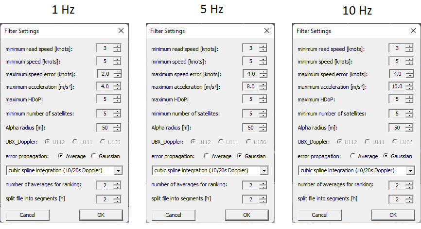
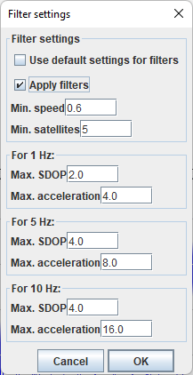

## Filtering - WIP

### Introduction

There are a number of ways that the quality of GPS data can be assessed.

The current [rules](https://www.gps-speedsurfing.com/default.aspx?mnu=item&item=BasicRules) of GP3S state the following:

>A valid run has no spikes and no strange accelerations or decelerations. If a spike occurs at the end of a run (because of a crash) the spike may be deleted and the run can count as a valid run. When there are strange decelerations a run can also be discarded.
>
>For Verified devices in the GPS analysis software the following settings are necessary:
>
>1. max. Accel. [5 m/s²]
>2. max. HDoP (5)
>3. min. Sats (5)

#### Notes

- Max. acceleration was originally 3 m/s² but was updated to 5 m/s² in the GP3S rules v9.0 A2 on 1 Jan 2012.
  - GPSResults and GPS Speedreader actually implement 4 m/s² for 1 Hz devices.
  - The [rules](https://www.gps-speedsurfing.com/default.aspx?mnu=item&item=BasicRules) on GP3S were only updated to show 5 m/s² in late 2015 / early 2016.
  
- Distance sailed has a minimum speed requirement of 5 knots since the GP3S rules v9.1 A2 on 12 Dec 2016.

### General

|                         | GPSResults | GPS Speedreader | GpsarPro            |
| ----------------------- | ---------- | --------------- | ------------------- |
| min. speed 1 | 5 knots    | 0.6 knots ?     | 5 knots - nm only ? |
| max. HDOP               | 5.0        | n/a ?           | 5.0 ?               |
| min. satellites         | 5          | 5 ?             | 5 ?                 |

1 - The minimum speed filter is applied to the distance sailed during a session. It was added to the GP3S rules v9.1 A2 on 12 Dec 2016.

The minimum speed filter is slightly controversial as can be see in the related [thread](https://www.gps-speedsurfing.com/default.aspx?mnu=forum&forum=1&val=123882) on GP3S.

### Maximum Speed Speed Error

This is derived from SDOP / SDOS (Locosys GT-31, GW-52, GW-60) or sAcc (u-blox devices such as the Motion or ESP-GPS).

|                          | GPSResults | GPS Speedreader (SiRF) | GPS Speedreader (UBX) | GpsarPro    |
| ------------------------ | ---------- | ---------------------- | --------------------- | ----------- |
| max. speed error @ 1 Hz  | 2.0 knots  | 2.0 knots              | 1.2 knots             | 2.0 knots ? |
| max. speed error @ 5 Hz  | 4.0 knots  | 4.0 knots              | 1.2 knots             | 2.0 knots ? |
| max. speed error @ 10 Hz | 4.0 knots  | 4.0 knots              | 1.2 knots             | 2.0 knots ? |

### Maximum Acceleration

This is derived from the change in speed between two readings. This naïve calculation results in higher values for 5 Hz and 10 Hz devices.

A dedicated article will discuss the topic of [acceleration](acceleration.md) in more detail.

|       | GPSResults | GPS Speedreader | GpsarPro |
| ----- | ---------- | --------------- | -------- |
| max. acceleration @ 1 Hz | 4 m/s2 | 4 m/s2 | ? |
| max. acceleration @ 5 Hz2 | 7.5 m/s2 | 8 m/s2 | ? |
| max. acceleration @ 10 Hz 1 2 3 | 15 m/s2 | 25 m/s2 | ? |
| max. acceleration @ 20 Hz | 30 m/s2 | n/a | ? |

1 - The max acceleration for 10 Hz devices was increased from 8 m/s2 to 10 m/s2 in GPSResults v6.173.

2 - The max acceleration for 5 Hz and 10 Hz devices was observed to be 7.5 m/s2 and 15 m/s2 in GPSResults v6.187.

3 - The max acceleration for 10 Hz devices was observed to be 25 m/s2 in GPS Speedreader v3.0.2.

### Altitude Changes

A dedicated article will discuss the topic of [altitude changes](altitude.md) in more detail.

### Screenshots

#### GPSResults

GPSResults v6.185 applies the following default filters:

#### GPS Speedreader

GPS Speedreader v1.4.3 applies the following default filters:

