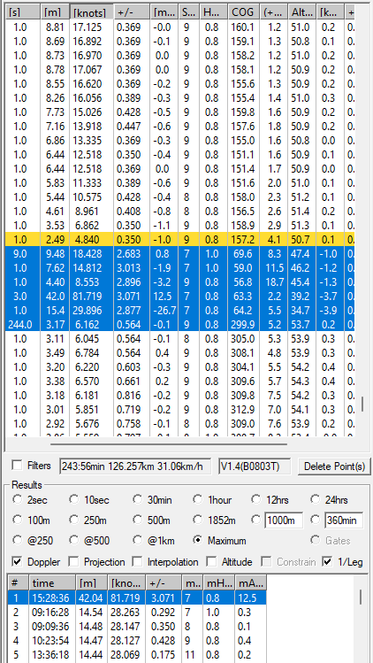

## Altitude - WIP

### Overview

Big spikes in even Doppler-derived speeds can occur and these may not picked up by either HDOP or satellite filters.

Whilst an issue is usually evident in SDOP / SDOS / sAcc, speed accuracy estimates are not recorded by all GPS devices, including the COROS watches.

Previous experience of Doppler spikes from the GT-11 and GT-31 have indicated that elevation / altitude is a useful diagnostic.

Looking at changes in elevation may be particularly when the acceleration is still within the accepted range.

### Example

A GT-31 track from 9 Oct 2012 contains an 81.72 knot Doppler spike which coincided with a notable change in altitude.

HDOP was fine at 0.8 - 1.0 and satellites were decent at 7 - 9. Only the acceleration of 12.5 m/s2 would have resulted in the speed being filtered out.

However, this example still illustrates how altitude can be a useful diagnostic of data reliability and maybe help to identify subtle spikes.

