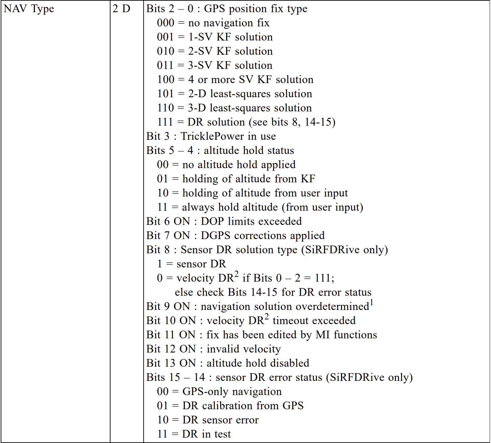

## SBN - SiRF Binary

### Geodetic Navigation Data - Message ID 41

This format is only generated by the Locosys GT-11 and GT-31.

The SiRF binary format consists of 91 to 97 byte messages which mainly originate from the Geodetic Navigation Data.

The first 91 bytes are standard SiRF and remaining bytes are specific to Locosys; unfiltered SOG + COG, SDOP and VSDOP.

SiRFDrive fields are always set to zero on the GT-11 and GT-31, so they can safely be ignored.

| SiRF Name                                         | Raw Name             | Type | Name  |  Type   | Units |     Resolution      |
| ------------------------------------------------- | -------------------- | :--: | :---: | :-----: | :---: | :-----------------: |
| Message ID 1                           | message_id           |  u1  |   -   |    -    |   -   |          -          |
| Nav Valid 2                            | nav_valid            | >u2  |   -   |    -    |   -   |          -          |
| Nav Type 3                             | nav_type             | >u2  |   -   |    -    |   -   |          -          |
| Extended Week Number                              | extended_week_no     | >u2  |  ts   | float64 |   s   | 1 x 10-6 |
| TOW                                               | time_of_week         | >u4  |   "   |    "    |   "   |          "          |
| UTC Year                                          | utc_year             | >u2  |   "   |    "    |   "   |          "          |
| UTC Month                                         | utc_month            |  u1  |   "   |    "    |   "   |          "          |
| UTC Day                                           | utc_day              |  u1  |   "   |    "    |   "   |          "          |
| UTC Hour                                          | utc_hour             |  u1  |   "   |    "    |   "   |          "          |
| UTC Minute                                        | utc_minute           |  u1  |   "   |    "    |   "   |          "          |
| UTC Second                                        | utc_millisecs        | >u2  |   "   |    "    |   "   |          "          |
| Satellite ID List                                 | sv_ids               | >u4  | svids | uint32  |   -   | 1 x 100  |
| Latitude                                          | latitude             | >i4  |  lat  | float64 |  deg  | 1 x 10-7 |
| Longitude                                         | longitude            | >i4  |  lon  | float64 |  deg  | 1 x 10-7 |
| Altitude from Ellipsoid                           | altitude_ellipsoid   | >i4  |   -   |    -    |   -   |          -          |
| Altitude from MSL                                 | altitude_msl         | >i4  |  ele  | float64 |   m   | 1 x 10-2 |
| Map Datum 4                            | map_datum            |  u1  |   -   |    -    |   -   |          -          |
| Speed Over Ground (SOG)                           | sog                  | >u2  |  sog  | float32 |  m/s  | 1 x 10-2 |
| Course Over Ground (COG, True)                    | cog                  | >u2  |  cog  | float32 |  m/s  | 1 x 10-2 |
| Magnetic Variation 5                   | magnetic_variation   | >i2  |   -   |    -    |   -   |          -          |
| Climb Rate                                        | climb_rate           | >i2  |  roc  | float32 |  m/s  | 1 x 10-2 |
| Heading Rate - SiRFDrive                          | heading_rate         | >i2  |   -   |    -    |   -   |          -          |
| Estimated Horizontal Position Error               | ehpe                 | >u4  | ehpe  | float32 |   m   | 1 x 10-2 |
| Estimated Vertical Position Error                 | evpe                 | >u4  | evpe  | float32 |   m   | 1 x 10-2 |
| Estimated Time Error - SiRFDrive                  | ete                  | >u4  |   -   |    -    |   -   |          -          |
| Estimated Horizontal Velocity Error - SiRFDrive   | ehve                 | >u2  |   -   |    -    |   -   |          -          |
| Clock Bias 6                           | clock_bias           | >i4  |   -   |    -    |   -   |          -          |
| Clock Bias Error - SiRFDrive                      | clock_bias_error     | >u4  |   -   |    -    |   -   |          -          |
| Clock Drift 6                          | clock_drift          | >i4  |   -   |    -    |   -   |          -          |
| Clock Drift Error - SiRFDrive                     | clock_drift_error    | >u4  |   -   |    -    |   -   |          -          |
| Distance - SiRFDrive                              | distance             | >u4  |   -   |    -    |   -   |          -          |
| Distance Error - SiRFDrive                        | distance_error       | >u2  |   -   |    -    |   -   |          -          |
| Heading Error - SiRFDrive                         | heading_error        | >u2  |   -   |    -    |   -   |          -          |
| Number of SVs in Fix                              | sv_count             |  u1  |  sat  |  uint8  |   -   | 1 x 100  |
| HDOP                                              | hdop                 |  u1  | hdop  | float32 |   -   | 2 x 10-1 |
| Additional Mode Info 7                 | additional_mode_info |  u1  |   -   |    -    |   -   |          -          |
| Unfiltered Speed Over Ground 8         | unfiltered_sog       | >u2  | sogu  | float32 |  m/s  | 1 x 10-2 |
| Unfiltered Course Over Ground 8        | unfiltered_cog       | >u2  | cogu  | float32 |  m/s  | 1 x 10-2 |
| Speed Dilution of Precision 9          | sdop                 |  u1  | sdop  | float32 |  m/s  | 1 x 10-2 |
| Vertical Speed Dilution of Precision 9 | vsdop                |  u1  | vsdop | float32 |  m/s  | 1 x 10-2 |

Notes:

1. Message ID is always 41 (geodetic navigation data), so it is ignored.
2. Navigation valid is always zero or one on the GT-11 and GT-31 and is currently ignored.
3. Navigation type is described in the SiRF binary protocol.
4. Map datum is typically 21 (WGS-84), so it is ignored.
5. Magnetic variation is always zero on the GT-11 and GT-31, so it is ignored.
6. Clock bias and clock drift are currently ignored.
7. Additional mode information is always zero on the GT-31 and always zero or one on the GT-11, so it is ignored.
8. Unfiltered SOG + COG were added by SiRF and Locosys for the GT-11.
9. SDOP and VSDOP were added by SiRF and Locosys for the GT-31, GW-62 and GW-60.

### TODO

Use navigation type to determine fix type; e.g. 2d or 3d.

Some of the other flags may also be of interest but they only apply to the GT-11 and GT-31, not the GW-52 or GW-60.

