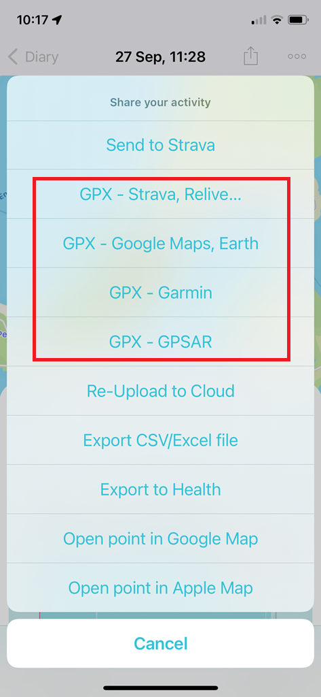

## GPS Exchange Format (GPX) - Waterspeed

### Background

Waterspeed currently provides 4 different GPX exports, pertaining to 4 different applications but this really should not be necessary:




GPX is a clearly defined standard with a public XSD, specifying how to create GPX files that are compatible with any application.

When the GPX exports from Waterspeed are inspected, it can be seen that none of them are actually GPX-compliant.

Different applications are tolerant of different issues in GPX files, but a single GPX-compliant file would be suitable for any application.


### GPX Validation

There are numerous ways to check compliance and validate a GPX file against the XSD. Several approaches are described at the [GPX home](https://www.topografix.com/gpx_validation.asp), but the simplest approach is to use an online validator such as the one at [freeformatter.com](https://www.freeformatter.com/xml-validator-xsd.html).

This example has been fixed by hand to ensure compliance with the GPX 1.1 schema. Simply paste it into the [XML Validator](https://www.freeformatter.com/xml-validator-xsd.html) and press "Validate XML".

```xml
<?xml version="1.0" encoding="UTF-8"?>
<gpx version="1.1"
     creator="Waterspeed"
     xmlns:xsi="http://www.w3.org/2001/XMLSchema-instance"
     xmlns="http://www.topografix.com/GPX/1/1"
     xmlns:gpxtpx="http://www.garmin.com/xmlschemas/TrackPointExtension/v2"
     xsi:schemaLocation="http://www.topografix.com/GPX/1/1
                         https://www.topografix.com/GPX/1/1/gpx-strict.xsd
                         http://www.garmin.com/xmlschemas/TrackPointExtension/v2
                         https://www8.garmin.com/xmlschemas/TrackPointExtensionv2.xsd">
  <metadata>
    <time>2022-10-29T12:55:24.000Z</time>
  </metadata>
  <trk>
    <name>Waterspeed Activity 450bce8c-04cc-4dfc-8360-a55aade3f1c8</name>
    <trkseg>
      <trkpt lat="50.5712707" lon="-2.4565614">
        <ele>0</ele>
        <time>2022-10-29T12:55:24.000Z</time>
        <extensions>
          <gpxtpx:TrackPointExtension>
            <gpxtpx:hr>120</gpxtpx:hr>
            <gpxtpx:speed>0.003</gpxtpx:speed>
            <gpxtpx:course>248.19</gpxtpx:course>
          </gpxtpx:TrackPointExtension>
        </extensions>
      </trkpt>
    </trkseg>
  </trk>
</gpx>
```

Note: The use of `gpx-strict.xsd` ensures the contents of `<extensions>` is fully validated. The `gpx-strict.xsd` reference should only be used during testing / development and `gpx.xsd` should be used in production.


### Changes Required

The above example was based on "GPX - Google Maps, Earth" generated by Waterspeed, but a number of changes were required for GPX compliance.

If these changes are implemented within the Waterspeed application then a single GPX export will be suitable for any application.


#### GPX Schema Location

The URL for the GPX schema at topografix needed to be fixed in `xsi:schemaLocation`:

```xml
<gpx xsi:schemaLocation="http://www.topografix.com/GPX/1/1 https://www.topografix.com/GPX/1/1/gpx.xsd">
```

n.b. This is the https endpoint because freeformatter.com does not support 301 redirects at this time.


#### Garmin Schema Version

TrackpointExtension/v1 does not support course or speed, TrackPointExtension/v2 is required:

```xml
<gpx xmlns:gpxtpx="http://www.garmin.com/xmlschemas/TrackPointExtension/v2">
```

n.b. TrackPointExtension/v2 is the only public GPX extension that supports speed and course at this time.


#### Garmin Schema Location

The URL for the Garmin extension needs to be added to `xsi:schemaLocation`:

```xml
<gpx xsi:schemaLocation="http://www.topografix.com/GPX/1/1
                         https://www.topografix.com/GPX/1/1/gpx.xsd
                         http://www.garmin.com/xmlschemas/TrackPointExtension/v2
                         https://www8.garmin.com/xmlschemas/TrackPointExtensionv2.xsd">
```

n.b. The subdomain hosting the Garmin extensions is now https://www8.garmin.com.


#### Timestamps

Timestamps can be formatted in one of two ways in GPX files, generally the "Z" approach is preferred:

```xml
<time>2022-10-29T12:55:24.000Z</time>
<time>2022-10-29T12:55:24.000+00:00</time>
```

The format "+0000" (missing colon) as used in the Google and Strava exports is not valid.


#### Ordering of Elements

The schemas for GPX and the Garmin TrackPointExtension have defined a strict ordering of XML elements.

This example illustrates the correct ordering for elevation, time, heart rate, speed and course:

```xml
<trkpt lat="50.5712707" lon="-2.4565614">
  <ele>0</ele>
  <time>2022-10-29T12:55:24.000Z</time>
  <extensions>
    <gpxtpx:TrackPointExtension>
      <gpxtpx:hr>120</gpxtpx:hr>
      <gpxtpx:speed>0.003</gpxtpx:speed>
      <gpxtpx:course>248.19</gpxtpx:course>
    </gpxtpx:TrackPointExtension>
  </extensions>
</trkpt>
```

Notes:

- `<ele>` and `<time>` are written in the wrong order in the "GPX - Strava, Relive" export
- `<gpxtpx:hr>` should always come before `<gpxtpx:speed>` and `<gpxtpx:course>`.


#### Heart Rate

A heart rate of "0" is invalid according to the XSD of Garmin's TrackPointExtension.

When heart rate is unknown, it should be omitted from the trackpoint.


#### Elevation

An elevation of "0" should not be included in trackpoints, unless the elevation has actually been measured as zero.

When elevation is unknown, it should be omitted from the trackpoint.

Ideally, elevation as calculated by the GPS / GNSS receiver should be recorded.


### Additional Observations

#### GPX Compliance

- Strava export is missing "creator"
  - This is one of the mandatory attributes in the `<gpx>` element
- The GPSAR export uses `<gpxdata:speed>` which is invalid as it has no associated schema
  - The authors of GPSAR and GPSResults has been notified that `<gpxtpx:speed>` is the valid approach
- The Garmin export uses "ns3" instead of "gpxtpx", and does not include course or speed
  - Garmin enforces strict GPX validation within their software, but GPX-compliant files will always be fine
  - Garmin will validate GPX extensions that they recognise, and ignore extensions that they don't recognise
  - There is no reason to omit speed and course from the Garmin export, simply use TrackPointExtension/v2
  - GPX writers are free to choose any namespace prefix (e.g. "ns3" or "gpxtpx"), but "gpxtpx" is pretty universal


#### Data Values

- Timestamps are out by one hour in the GPSAR export, differing from the 3 other GPX exports
  - All times in GPX files should be in UTC and not specific to one application


### Speed

The use of `<gpxdata:speed>` should be regarded as an interim solution, since it will result in errors when validating GPX files against `gpx-strict.xsd`. However, in the not too distant future GPSAR, GPSResults, and GPS-Speedsurfing will all support `<gpxtpx:speed>` and will not require `<gpxdata:speed>` to be present in GPX files.

There will be a transitional period where both `<gpxdata:speed>` and `<gpxtpx:speed>` should be included in a single GPX file (e.g. uploads to GPS-Speedsurfing), but this should be regarded as an interim solution. The inclusion of `<gpxdata:speed>` in GPX exports should be accepted by all major software, including Garmin products.

In the future, there will be no requirement for `<gpxdata:speed>`. GPX files including `<gpxtpx:speed>` are fully compliant with the schemas for GPX 1.1 and TrackPointExtension v2 and will pass the "strict" validation of `gps-strict.xsd`. 


### Suggestion

I would suggest updating Waterspeed to offer just two GPX exports:

1. Universal GPX export to replace the GPX exports for Strava, Google and Garmin
2. Modified GPX export, including `<gpxdata:speed>` as well as `<gpxtpx:speed>`

The second export would be for GPSAR and GPS-Speedsurfing.com, until such time as they no longer require `<gpxdata:speed>`. It has the advantage of being compatible with existing software, but also allows GPSAR and GPS-Speedsurfing.com to smoothly transition to the universal GPX export.


#### GPX - Universal

This would be a fully compliant GPX file as described in this document. The GPX header would be as follows:

```xml
<?xml version="1.0" encoding="UTF-8"?>
<gpx version="1.1" creator="Waterspeed"
     xmlns:xsi="http://www.w3.org/2001/XMLSchema-instance"
     xmlns="http://www.topografix.com/GPX/1/1"
     xmlns:gpxtpx="http://www.garmin.com/xmlschemas/TrackPointExtension/v2"
     xsi:schemaLocation="http://www.topografix.com/GPX/1/1
                         https://www.topografix.com/GPX/1/1/gpx.xsd
                         http://www.garmin.com/xmlschemas/TrackPointExtension/v2 
                         https://www8.garmin.com/xmlschemas/TrackPointExtensionv2.xsd">
```

A trackpoint would only require `<gpxtpx:speed>` for speed:

```xml
<trkpt lat="50.5712707" lon="-2.4565614">
  <ele>0</ele>
  <time>2022-10-29T12:55:24.000Z</time>
  <extensions>
    <gpxtpx:TrackPointExtension>
      <gpxtpx:hr>120</gpxtpx:hr>
      <gpxtpx:speed>0.003</gpxtpx:speed>
      <gpxtpx:course>248.19</gpxtpx:course>
    </gpxtpx:TrackPointExtension>
  </extensions>
</trkpt>
```


#### GPX - GPSAR

This would be a modified version of the universal GPX export. The GPX header would be as follows:

```xml
<?xml version="1.0" encoding="UTF-8"?>
<gpx version="1.1" creator="Waterspeed"
     xmlns:xsi="http://www.w3.org/2001/XMLSchema-instance"
     xmlns="http://www.topografix.com/GPX/1/1"
     xmlns:gpxtpx="http://www.garmin.com/xmlschemas/TrackPointExtension/v2"
     xmlns:gpxdata="http://www.cluetrust.com/XML/GPXDATA/1/0"
     xsi:schemaLocation="http://www.topografix.com/GPX/1/1
                         https://www.topografix.com/GPX/1/1/gpx.xsd
                         http://www.garmin.com/xmlschemas/TrackPointExtension/v2 
                         https://www8.garmin.com/xmlschemas/TrackPointExtensionv2.xsd">
```

Note the addition of `xmlns:gpxdata` in the GPX header but the lack of a corresponding XSD in `xsi:schemaLocation`.

A trackpoint would use `<gpxtpx:speed>` and `<gpxdata:speed>` for speed:

```xml
<trkpt lat="50.5712707" lon="-2.4565614">
  <ele>0</ele>
  <time>2022-10-29T12:55:24.000Z</time>
  <extensions>
    <gpxtpx:TrackPointExtension>
      <gpxtpx:hr>120</gpxtpx:hr>
      <gpxtpx:speed>0.003</gpxtpx:speed>
      <gpxtpx:course>248.19</gpxtpx:course>
    </gpxtpx:TrackPointExtension>
    <gpxdata:speed>0.003</gpxdata:speed>
  </extensions>
</trkpt>
```

The presence of `<gpxtpx:speed>` and `<gpxdata:speed>` will mean that this export is suitable for the existing versions of GPSAR and GPS-Speedsurfing, but they can transition to `<gpxtpx:speed>` in the future. Eventually, the GPSAR export will become redundant and can be removed from Waterspeed.


### Summary

Ensuring that GPX exports from Waterspeed are GPX-compliant will mean that the 4 existing GPX exports can replaced with a single GPX export in the longer term. To allow for a smooth transition to this single format an additional GPSAR export is also suggested, as described earlier.

All of the changes are relatively straightforward to implement, and validation of GPX files during development is extremely easy using [freeformatter.com](https://www.freeformatter.com/xml-validator-xsd.html). Both of the exports described in the previous section (universal GPX and GPSAR) should pass the online validation.

I hope this information is helpful, and I hope the Waterspeed developer(s) can find the time to implement these changes.

