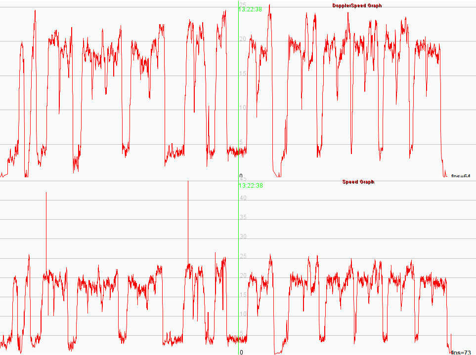

## GPS Exchange Format (GPX) - Doppler Speed

### Introduction

The term "doppler speed" was coined by the [GPS-Speedsurfing](https://www.gps-speedsurfing.com/) community and refers to the speed that is calculated by the GPS receiver in real-time.

The "doppler speed" is derived from the observable [Doppler shift](https://en.wikipedia.org/wiki/Doppler_effect) of the satellite signals. Doppler shift is always evident due to the perpetual motion of the GPS satellites and the receiver. Estimating the speed of the GPS receiver from the observable Doppler shift is far less susceptible to errors than retrospective calculations using the positional data (i.e. longitude and latitude).

Conversely, speeds that are calculated retrospectively from positional data are highly susceptible to "spikes" which are erroneous speeds due to blocked signals, imperfections in the GPS receiver, etc. Sometimes these "spikes" will be very obvious (e.g. 60+ knots on a windsurfer) but other times they will be small enough for people to believe they are genuine speeds.

It's worth noting that every GPS and watch manufacturer will have their own way of calculating the speed of the receiver in real-time but they will typically make use of the observable Doppler-shift (already a necessity in order to receive the satellite data) and a [Kalman filter](https://en.wikipedia.org/wiki/Kalman_filter) to reduce "noise". For convenience, this document will simply refer to "doppler speed", regardless of how the GPS receiver calculates it.


#### Example 1

The first example is from an Apple Watch, recorded using the Waterspeed app.

There are very obvious "spikes" of around 33.7 knots, 36.9 knots and 31.3 knots present in the non-Doppler speed graph on the right.

The fastest non-Doppler speed that was not an obvious spike was 23.9 knots. The fastest Doppler speed (more likely to be accurate) was 22.5 knots.


#### Example 2

The second example is also from an Apple Watch, recorded using the Waterspeed app.

There are very obvious "spikes" of around 42 knots and 45 knots present in the non-Doppler speed graph on the right.

The fastest non-Doppler speed that was not an obvious spike was 26.4 knots. The fastest Doppler speed (more likely to be accurate) was 25.4 knots.




### GPX 1.0

The [GPX 1.0](https://www.topografix.com/GPX/1/0/gpx.xsd) format of 2002 allowed "speed" (typically "doppler speed" in modern GPS receivers) to be recorded in GPX files using the `<speed>` element. The same was also true for "[course of ground](https://en.wikipedia.org/wiki/Course_(navigation))" using the `<course>` element. 


### GPX 1.1

[GPX 1.1](https://www.topografix.com/GPX/1/1/gpx.xsd) was released in August 2004 which added lots of new capabilities, including extension features but for some reason it removed the `<speed>` and `<course>` elements. It looks like this was a simple oversight when reviewing the schema changes but it may have been a conscious decision.


### The "Hack" Approach

The kickstarter [Trace](https://www.kickstarter.com/projects/activereplay/trace-the-most-advanced-activity-monitor-for-actio) overcame the GPX 1.1 oversight by introducing an element called `<gpxdata:speed>` as a trackpoint extension. 

Trace had no option but to invent a new element but they should really have created their own “trace” schema (including "speed" and "course"), declared it using a suitable xmlns:trace and xsi:schemaLocation and published the schema (defining "speed" and "course") on the web.

Unfortunately the use of `<gpxdata:speed>` has now percolated into other applications, including [Waterspeed](https://waterspeedapp.com/) (for Apple devices) which means yet more GPX files being created with a non-standard approach (gpxdata:speed) which is not supported by [GPSResults](https://www.gps-speed.com/), [GPS-Speedsurfing.com](https://www.gps-speedsurfing.com/), etc.

Side note: The original [GPXData](http://www.cluetrust.com/Schemas/gpxdata10.xsd) schema / namespace was created by ClueTrust and does not support "speed" or "course" (i.e. course over ground).


### The "Correct" Approach

Garmin have added "speed" and "course" to version 2 of their [TrackPointExtension](https://www8.garmin.com/xmlschemas/TrackPointExtensionv2.xsd) schema, some time around 2015.

This means that with the appropriate GPX header (i.e. defining the namespace and schemaLocation) it is possible to include `<speed>` and `<course>` elements in GPX 1.1 files.

An example header:

```xml
<gpx version="1.1" creator="Garmin Connect"
  xmlns="http://www.topografix.com/GPX/1/1"
  xmlns:tpx="http://www.garmin.com/xmlschemas/TrackPointExtension/v2"
  xmlns:xsi="http://www.w3.org/2001/XMLSchema-instance"
  xsi:schemaLocation="http://www.topografix.com/GPX/1/1 http://www.topografix.com/GPX/1/1/gpx.xsd 
                      http://www.garmin.com/xmlschemas/TrackPointExtension/v2 http://www.garmin.com/xmlschemas/TrackPointExtensionv2.xsd"
```

Trackpoints can then record speed and course (plus data such as heartrate) inside an `<extensions>` element:

```xml
<extensions>
  <tpx:TrackPointExtension>
    <tpx:speed>0.5429</tpx:speed>
    <tpx:course>157.19</tpx:course>
    <tpx:hr>120</tpx:hr>
  </tpx:TrackPointExtension>
</extensions>
```

Note: The namespace prefix "tpx" is not fixed and is chosen by the GPX creator. Garmin often uses "ns3", whereas some other software providers use "gpxtpx". No assumptions should be made about namespace prefix(es) being used in GPX files.


### Downside of the "Correct" Approach

At this time (Nov 2022), neither [GpsarPro](http://www.gpsactionreplay.com/), [GPSResults](https://www.gps-speed.com/) nor [GPS-Speedsurfing.com](https://www.gps-speedsurfing.com/) support version 2 of Garmin's [TrackPointExtension](https://www8.garmin.com/xmlschemas/TrackPointExtensionv2.xsd) schema.

This means that although you can create a GPX 1.1 complaint file containing "speed" and "course" they will be ignored by most popular tools.

I will suggest to Manfred (GPSResults) and Yann (GpsarPro) that they add support for GPX 1.1 files and version 2 of Garmin's [TrackPointExtension](https://www8.garmin.com/xmlschemas/TrackPointExtensionv2.xsd) schema.


### Workaround using GPX 1.0

The `<speed>` element of GPX 1.0 is already supported by [GpsarPro](http://www.gpsactionreplay.com/), [GPSResults](https://www.gps-speed.com/), [GPS-Speedsurfing.com](https://www.gps-speedsurfing.com/) and many other popular pieces of software.

Unless you really need GPX 1.1 (e.g. heartrate data being required) then it makes sense to use GPX 1.0 for GPS-Speedsurfing applications.


### Workaround using GPX 1.1

If you really must use GPX 1.1 then you should use the correct approach (described earlier) but also supplement it with `<gpxdata:speed>`.

```xml
<extensions>
  <gpxdata:speed>0.5429</gpxdata:speed>
  <tpx:TrackPointExtension>
    <tpx:speed>0.5429</tpx:speed>
    <tpx:course>157.19</tpx:course>
    <tpx:hr>120</tpx:hr>
  </tpx:TrackPointExtension>
</extensions>
```

You will also need to add the "gpxdata" namespace and schema location to the GPX, if it is to be a valid XML document:

```xml
<gpx version="1.1" creator="Garmin Connect"
  xmlns="http://www.topografix.com/GPX/1/1"
  xmlns:tpx="http://www.garmin.com/xmlschemas/TrackPointExtension/v2"
  xmlns:gpxdata="http://www.cluetrust.com/XML/GPXDATA/1/0"
  xmlns:xsi="http://www.w3.org/2001/XMLSchema-instance"
  xsi:schemaLocation="http://www.topografix.com/GPX/1/1 http://www.topografix.com/GPX/1/1/gpx.xsd 
                      http://www.garmin.com/xmlschemas/TrackPointExtension/v2 http://www.garmin.com/xmlschemas/TrackPointExtensionv2.xsd
                      http://www.topografix.com/GPX/1/0/gpx.xsd http://www.cluetrust.com/XML/GPXDATA/1/0 http://www.cluetrust.com/Schemas/gpxdata10.xsd"
```

Notes:

1) As of now, this workaround will only work for GpsarPro. It won't work for GPSResults or GPS-Speedsurfing.com.

2) ClueTrust do not specify "speed" or "course" in their schema but most XML validation tools will not report an error, because they only verify items in the default XML namespace.

3) The namespace prefix cannot be assumed so it could be "tpx", "gpxtpx", "gpxdata", ns3" or something else entirely. A simple solution is to ignore the namespace prefixes within `<extensions>` and use anything named "speed", "course" or "cog", regardless of their namespace prefix.