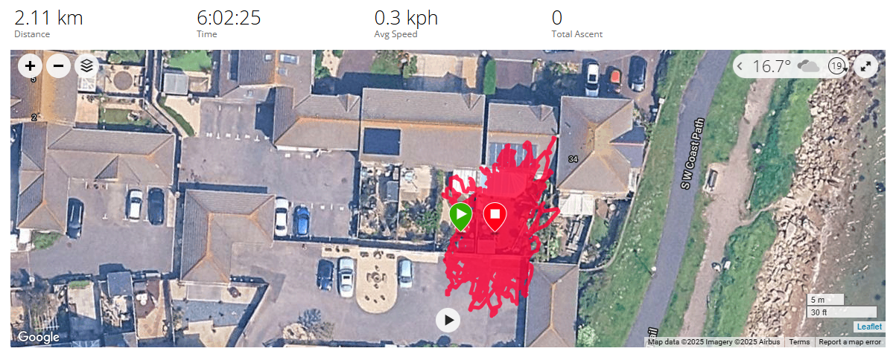
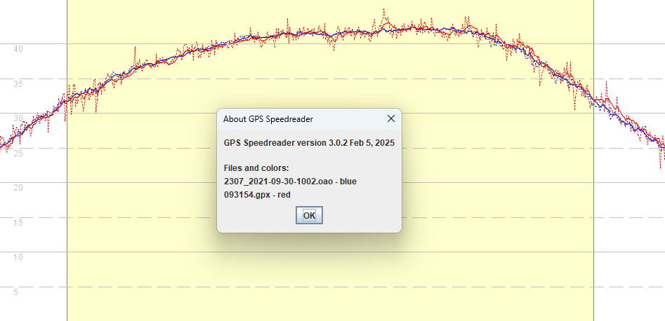
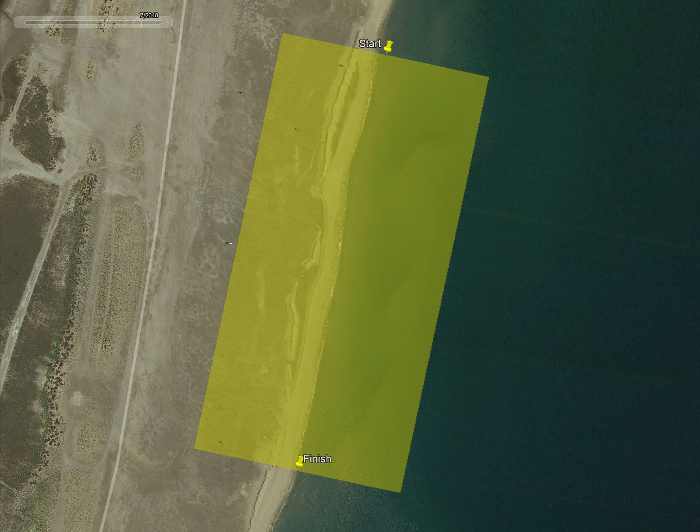
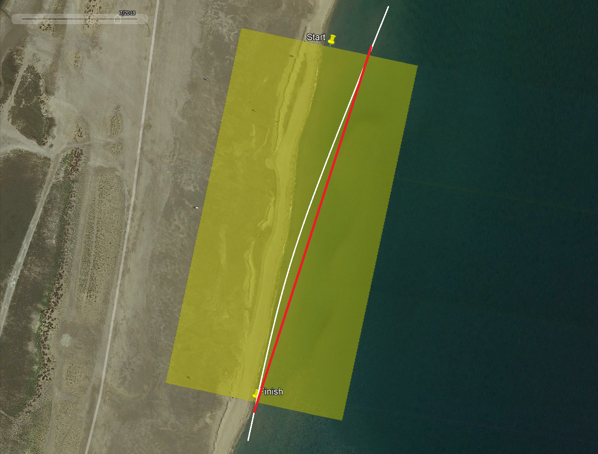
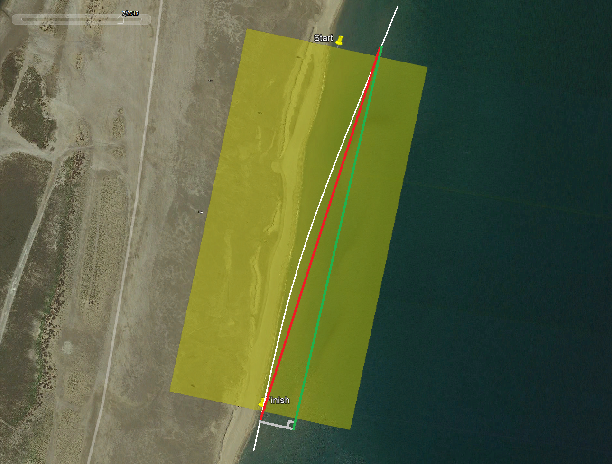

## Gated 500 m

Author: Michael George

Date created: 21 Sep 2025

### Introduction

This document has been written relatively quickly to share some thoughts about the calculation of real-time 500 m results for Prince of Speed events.

Due to limited time it will not provide any detailed algorithms or formulas. It will describe the general concepts and also assume some basic understanding of how Global Navigation Satellite Systems (GNSS) work.

Topics will include a brief overview of GNSS accuracy, significance of positional errors and also the need for filtering / smoothing to cope with noise / sawtooth artefacts.

### GNSS Overview

#### Positional Accuracy

The GNSS chipset inside any device is responsible for calculating Position, Velocity and Time (PVT) at fixed intervals, typically at 1 Hz, 5 Hz, or 10 Hz.

Position is calculated based on the time that it takes for the GNSS signals to travel from the various satellites to the receiver. This process is known as trilateration and errors can arise in the calculated position for a number of reasons. These reasons include errors in the satellite's predicted position, deviations in the satellite's atomic clock, atmospheric errors (ionospheric delay and tropospheric delay), multi-path errors, and electronic noise within the receiver itself.

The effect of these errors can be illustrated with a stationary GNSS receiver, recording for several hours. The screenshot below shows a stationary receiver (Garmin Forerunner 645 Music) recording non-stop for 6 hours. There are a variety of statistics to summarise positional errors but the most common one used by GNSS chipset manufacturers is Circle Error Probable (CEP). CEP states that 50% of points are likely to be within the specified distance from the true location and 50% will be farther away. u-blox GNSS chipsets generally quote a CEP of either 1.5 m or 2.0 m.

#### Speed Accuracy

The GNSS chipset within a receiver also calculates what is known as Speed Over Ground (SOG) but it does not calculate it by measuring the distances between points. The GNSS signals are subject to the Doppler Effect that also causes the pitch of a police siren or racing car to change, depending on whether it is getting closer or farther away. GNSS receivers must ascertain the Doppler shift (change in carrier frequency) in order to acquire and track the signals, but the Doppler-shifts provide an additional benefit. The Doppler shifts themselves can be used to calculate the speed of the receiver.

The benefit of the Doppler-derived speeds is that they are immune to the majority of error sources that affect positional accuracy. This is why websites such as GPS-Speedsurfing have been using Doppler-derived speeds for their rankings for almost 20 years. Generally speaking, errors in the Doppler-derived speeds are an order of magnitude lower than the errors in position-derived speeds. However, GNSS chipsets from some manufacturers (including u-blox) may also use an approach called carrier-smoothing which improves the pseudo-range measurements and thus positional accuracy.

The image below compares a 20 Hz custom u-blox device (red) and 10 Hz Motion (blue) with the solid lines being the Doppler-derived speeds and dotted lines being the position-derived speeds. The data from the 20 Hz custom device is noisier than the Motion, especially the position-derived speeds (dotted red line), possibly due to the fact that the 20 Hz device is not using so many GNSS constellations, or possibly because of the antenna, or possibly due to other electronic noise within the receiver itself. Whatever the cause it suggests inaccuracies in the 20 Hz positional measurements.

### Algorithms / Approaches

#### 500 Meter Course

The 500 m course in La Palme is the same for every Prince of Speed event. It has been defined in GPSResults to include the beach, so that tests can be performed on a motorised vehicle such as a quad bike. During foiling heats the course needs to be doubled in width to capture all of the runs.

An imaginary run is shown below, just to illustrate how runs may not be parallel to the course. It is the time taken between the start and finish lines that matters, or the average velocity <u>parallel to the course</u>.

#### Position-Derived Speed

When recording at 10 Hz, board speeds of 45 knots (23 m/s) will result in points that are 2.3 meters apart. The image below shows a straight line from the point immediately prior to the start line to the point immediately after the finish line (shown in red). The speed between the two points may be calculated (speed = distance / time) but that is not what the competition requires.

It is the average velocity parallel to the course which is required, shown in green. It is worth noting that although the start and end points may be a couple of meters from the start / finish lines the effect is rarely significant.

Interpolation may be used to identify the (likely) position and time when the rider crossed the start / finish lines. The average velocity down the course can then be calculated by dividing the course length by the time interval between the interpolated points, so speed = distance / time.

Note: If interpolation is used then the effects of "noisy" positional data should be considered. The graph shown earlier included a dotted red line for position-derived speeds (20 Hz custom u-blox logger) with lots of "sawtooth" artefacts due to positional inaccuracies. The sawtooth artefacts represent unrealistic changes in positions and thus some kind of filtering / smoothing needs to be employed prior to any interpolation.

One possible approach would be to use a centred moving average (CMA) with a period of 2 seconds, then linear interpolation between points either side of a start / finish line. In theory you could factor in acceleration / deceleration when trying to determine when the lines were crossed but calculated acceleration / deceleration is even more noisy than position-derived speeds, so simple linear interpolation is likely to be more effective.

#### Time-Derived Speed

The point immediately prior to the start line and the point immediately after the finish line will <u>always</u> give an elapsed time exceeding the true time that it took to sail the course. This is because the start and end points can potentially be up to 2.3 meters from the start / finish line when sailing at 45 kts (23 m/s) with 10 Hz logging. At the extremes, this could mean an elapsed time relating to a 500 m run or 504.6 m run.

So, unlike the position-derived approach it is not possible to simply use the point immediately prior to the start line and immediately after the finish line. Some kind of filtering / smoothing and interpolation will be required.

Note: 20 Hz logging may halve the discrepancies but on the flipside positions may be less accurate, especially if less GNSS constellations are being used.

If the 500 m result is to be calculated on the basis of course length / time, it will be necessary to determine when the rider crossed the start and finish lines. So, this is essentially the same calculation as described earlier (position-derived speed with interpolation) and thus requires some filtering / smoothing to ensure that interpolation (calculation of the intersection with the start / finish line) is realistic.

#### Doppler-Derived Speed

The final method is to use the Doppler-derived Speed Over Ground (SOG) and Course Over Ground (COG) to determine the average velocity parallel to the course itself. This involves calculating individual velocity-vectors parallel with the course, adding them up and dividing by the number of points to give an average. The image below attempts to illustrate this and just like position-derived speeds, start / end points that are before / after the start / finish points does not have any significant impact. Filtering / smoothing and interpolation is still possible, but not essential.

### Which is Best?

For 2 secs, 10 secs and un-gated 500 m it is widely recognised that that use of Doppler-derived speeds produces much more accurate results. It becomes much more nuanced when it comes to calculating 500 m results for a course with gates.

- The errors relating to Doppler-derived speeds are cumulative (over 500 meters) but to a large extent cancel each other out, essentially oscillating around the true value.

- The errors relating to position-derived / time-derived results are dependent on the accuracy of the start and end points. Positional errors tend to be similar for adjacent and nearby points, but they can change by several meters during a 500 m run.

Filtering / smoothing of positional data prior to interpolation (calculating the intersection with the start / finish line) will help position-derived results, but may not entirely mitigate the risks associated with the use of positional data for 500 m results.

That being said filtering / smoothing and interpolation should is almost certainly required for time-derived results. Failure to do so will result in occasional errors up to 0.2 or 0.3 kts, in addition to errors due to changes in positional inaccuracies for which there is no obvious mitigation.

As mentioned earlier in this document, position-derived results using filtering / smoothing and interpolation are essentially the same as time-derived results using filtering / smoothing and interpolation. Most of the time the results are likely to be very similar to Doppler-derived results.

### How to Test?

Testing may take place during or outside of an official competition.

If a GNSS logger such as the LISA is capable of calculating results for a 500 m course, ideally it should log those results to the SD card.

In this way the results calculated after each run can be compared to the Doppler-derived and position-derived results of GPSResults.

Testing the reliability of the results will require a fair amount of test data, but I would be happy to assist and review the results.