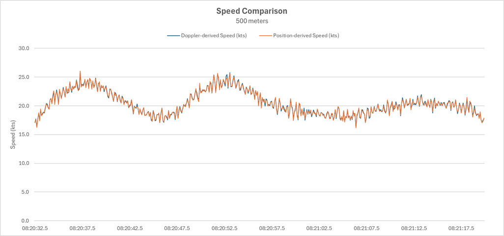
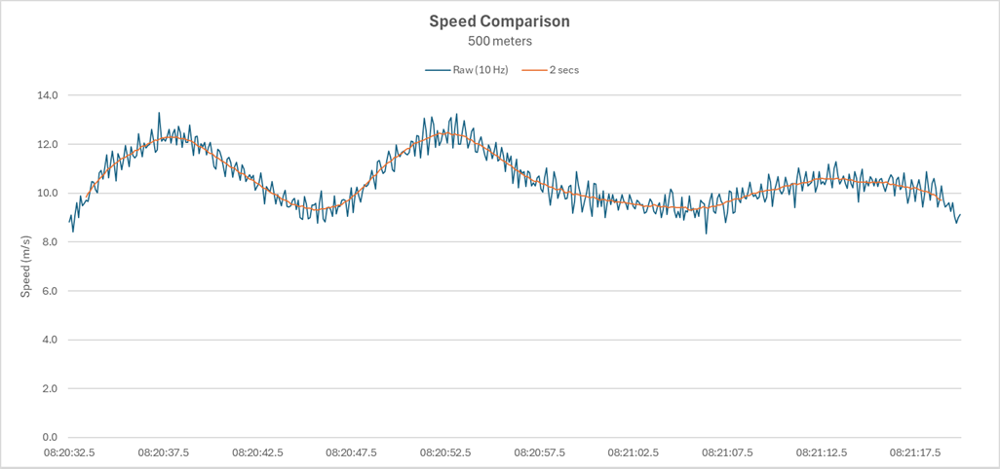
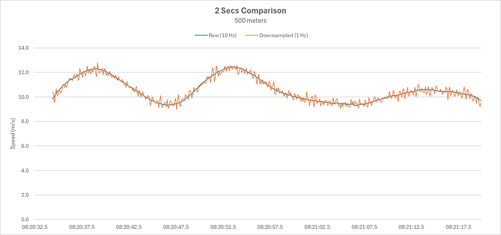
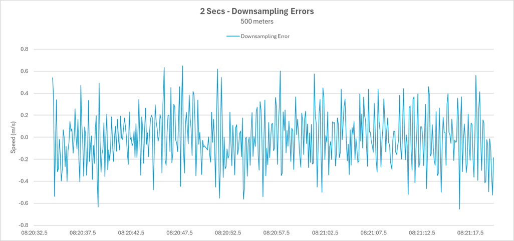
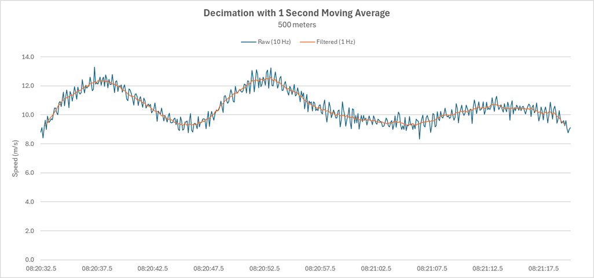
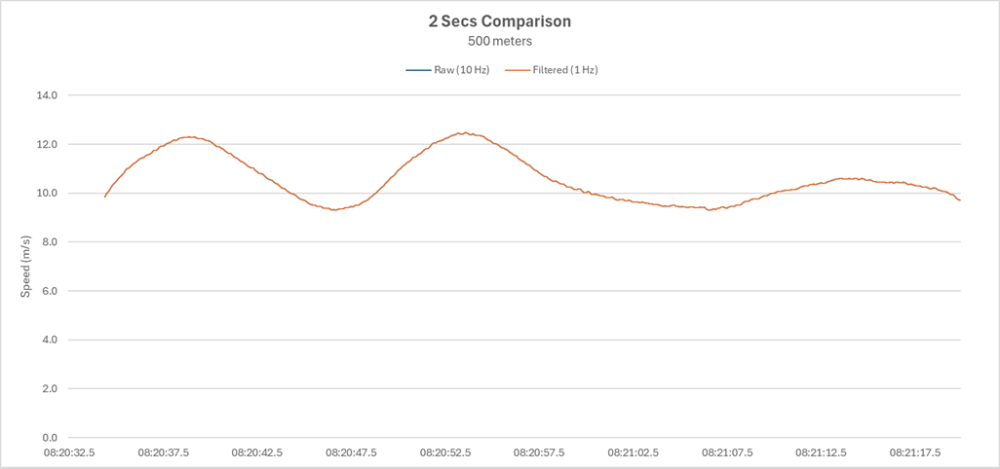
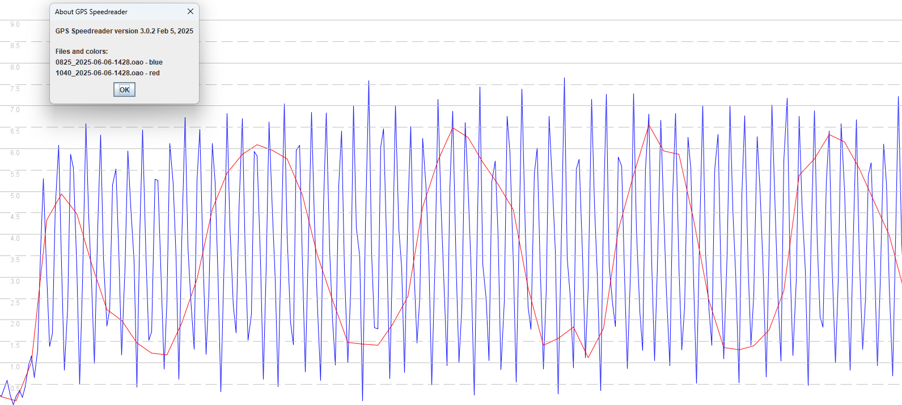
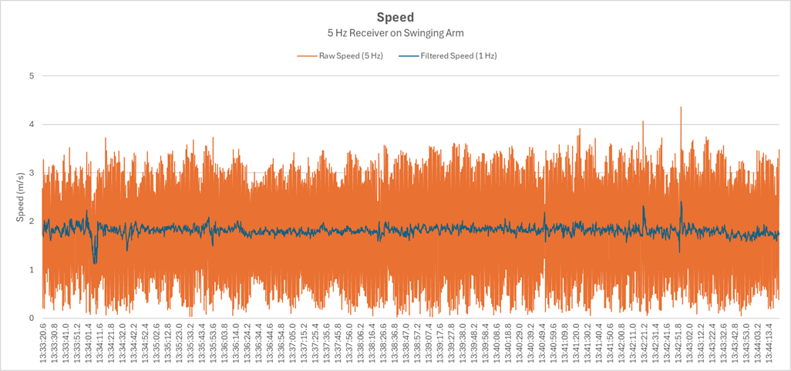
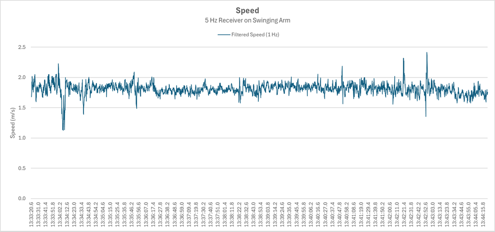

## Downsampling and Decimation

Author: Michael George

Date created: 14 Dec 2025

### Overview

Participants in the speed sailing community have been using 5 Hz and 10 Hz GPS loggers for more than 10 years. One of the benefits of the higher sampling rates is that they lead to more robust speed results, so long as a moving average is applied to the data.

The de-facto measure for "top speed" is the 2 second average, essentially averaging 10 data points from a 5 Hz logger, or 20 data points from a 10 Hz logger. The errors affecting individual readings typically cancel out, even within a period as short as 2 seconds.

When converting to 1 Hz there are some important factors to be considered. The current practice of [downsampling](https://en.wikipedia.org/wiki/Downsampling_(signal_processing)) retains every 5th sample of the 5 Hz data, or 10th sample of 10 Hz data. This can cause unintended consequences downstream, which will be discussed.

### Example 1 - Windsurfing

#### Recorded Speeds

The image below shows some data from an [ESP-GPS](https://www.seabreeze.com.au/forums/Windsurfing/Gps/Another-DIY-GPS-logger-approach) recording at 10 Hz. The speeds calculated from observable Doppler-shifts and positional changes happen to be very similar. A couple of possible reasons include the [u-blox](https://www.u-blox.com/en/positioning-chips-and-modules) chipset using carrier smoothing for its [pseudo-range](https://en.wikipedia.org/wiki/Pseudorange) observables, and the use of a [Kalman filter](https://en.wikipedia.org/wiki/Kalman_filter) which uses speed to estimate position.

Regardless of the underlying reasons for the similarities, it should be noted that the data also suggests the windsurfer is speeding up and slowing down by 2 or 3 kts every 0.1 seconds. This clearly doesn't represent the true nature of the board speed, so this data should be considered as [noisy](https://en.wikipedia.org/wiki/Noisy_data).

#### 2 Second Average

Calculating a 2 second moving average gives a very good idea of the true speed of the windsurfer at any point in time. The image below shows the raw 10 Hz data and a 2 second average, centred to improve the clarity. The value of the 2 second average can be taken at any point in time and gives a very reliable measure of the true speed, essentially filtering out the irrelevancies / noise.

#### Downsampling

If this data were to be [downsampled](https://en.wikipedia.org/wiki/Downsampling_(signal_processing)) (only keeping every 10th sample) then it should be noted that the ability to subsequently calculate a reliable 2 second average is lost. The image below compares the original 2 second averages and possible 2 second averages from the 1 Hz data.

The image below shows the discrepancies and they are sometimes in excess of 0.6 m/s, which is over 1.2 knots. This will be problematic if a user imports the 1 Hz GPX file into a platform such as Waterspeed, because it will produce misleading results.

#### Decimation

In digital signal processing the process known as [decimation](https://dspguru.com/dsp/faqs/multirate/decimation/) uses a low-pass filter, prior to the decimation. Whilst a low-pass filter often applies to the [frequency domain](https://en.wikipedia.org/wiki/Frequency_domain) it is also possible to use a 1 second moving average as a filter in the [time domain](https://en.wikipedia.org/wiki/Time_domain).

The benefit of using a 1 second moving average is that all subsequent calculations (e.g. 2 second average) will match the original data. The 1.2 kts increase seen earlier simply cannot occur, so naïve use of 1 Hz GPX files will not produce erroneous results.

### Example 2 - Walking

An earlier article discussed the concept of [aliasing](https://logiqx.github.io/gps-details/general/aliasing/) present in 1 Hz recordings from some GPS loggers, including the Motion and ESP-GPS. The chart below shows 5 Hz data (blue) and 1 Hz data (red) during a short walk. The 5 Hz data can be used to determine a relatively good estimate of the pace / walking speed using of a simple 1 second moving average, but the 1 Hz data is almost useless due to the nature of the aliasing.

Whilst walking may seem unrelated to windsurfing, it is useful when trying to determine whether a device is prone to aliasing, and to create data which exceeds the maximum acceleration possible on a windsurfer. A separate article will discuss the nuances of acceleration in the context of 5 Hz and 10 Hz data. Within the scope of this document, accurate 1 Hz data is the primary focus.

The original 5 Hz measurements (orange) may be a good representation of the arm speed, but filtering will be required if downsampling to 1 Hz. In this instance, even a simple 1 second moving average (blue) provides a relatively realistic measure of instantaneous speed.

Whilst the original data contains insights into the arm movements (and potentially includes measurement errors) something needs to the done prior to downsampling. 1 second averages will be a lot more useful in subsequent analysis than 1 Hz data containing aliasing artifacts.

### Conclusions

The production of 1 Hz data through the use of downsampling alone is problematic when it comes to speed analysis and measures such as "max 2 seconds". It is highly advisable that conversions from 5 Hz / 10 Hz data to 1 Hz data implement suitable filtering, prior to the downsampling. Ideally this would be implemented on devices such as the Motion, ESP and LISA when they produce GPX exports containing 1 Hz data.

The simplest approach is to simply use a 1 second moving average. The efficacy of this simple approach was demonstrated in this document and results subsequently calculated from the 1 Hz GPX will never exceed the original 5 Hz / 10 Hz data. A simple trailing moving average should be implemented (not centred moving average), since speeds from a trailing average will be best-aligned with position-derived speeds in the 1 Hz data.

### Next Steps

Discuss this topic with key stakeholders and the various developers; software and hardware. Sadly there is no active development on the Motion, so it is unlikely that it will be modified in the near future, but the ESP and LISA would both benefit from these ideas. There are people who have built an ESP for themselves and intending to post their results to the Waterspeed app. It would therefore be beneficial for GPX files from the ESP to calculate a 1 second moving average, prior to the downsampling of 5 Hz / 10 Hz data.
