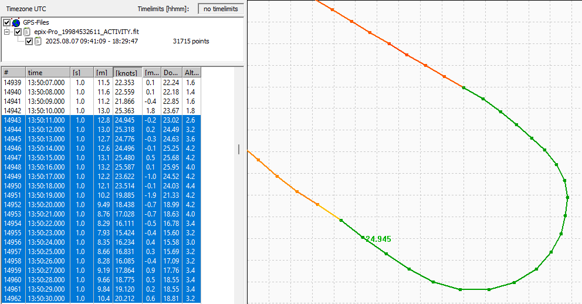
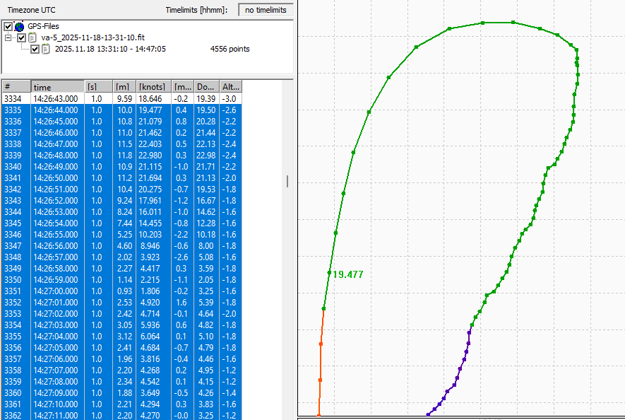
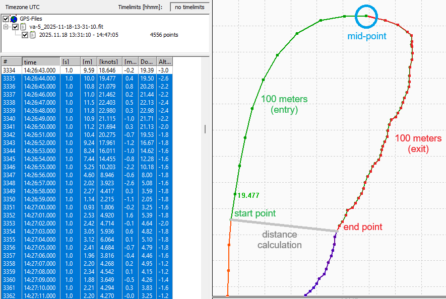

## Gybe Analysis

Author: Michael George

Date created: 22 Nov 2025

### Introduction

Gybing is fun for windsurfers of all ages and abilities, yet extremely technical and highly worthy of GPS analysis.

- Intermediate windsurfers will often aspire to coming out of their gybes planing, which means maintaining a speed above 8 or 10 kts.
- Advanced windsurfers want to minimise the speed lost during the gybe, and enter / exit their gybes at ever increasing speeds.

The difference between a good and bad gybe is essentially the exit speed, and reducing the time it takes to get back up to speed. We already have [alpha racing](../../alpha-racing/README.md) but that has the requirement to return to within 50 meters of the starting location.

What would be ideal is to have a collection of gybe metrics that can be used to rate individual gybes, even if they do not qualify for an alpha.  This document has been created to jot down a few thoughts about the measurement of gybes and tacks.

### Example Gybes

This section shows what good and bad gybes look like using real GPS data. The examples show the most important 200 meters worth of GPS data in green, which will subsequently form the basis for gybe analysis.

The first example is a good windfoil gybe, entering at 25 kts and never dropping below 15 kts. The gybe was fully foiling and the speed of the final data point was slightly over 20 kts.

The second example shows a windfoil gybe which was initiated at 20 kts but dropping off the foil, and then chugging at 4 kts. Whilst the entry looks nice and smooth the slow exit speeds make it a bad gybe.

It can easily be seen how the data points for the gybe exit are bunched up due to the slow speeds, and thus making it a bad gybe.

### Fundamentals

Prior to calculating any gybe metrics it is necessary to decide which data points constitute each gybe.

One relatively simple approach would be to consider all of the possible mid-points for the gybe. An accumulated distance of 100 meters prior to the mid-point point dictates the start point, and accumulated distance of 100 meters after to mid-point dictates the end point.

The straight-line distance between the start point and end point can be calculated for every possible mid-point. Theoretically, the "best choice" of mid-point for the gybe will be the one with the shortest distance between the start and end points.

The goal is to see a comparable entry (100 meters ) and exit (100 meters). The example below illustrates how the shortest possible grey line will result in the best possible mid-point, just by considering the preceding 100 meters and following 100 meters.

### Metrics

Once the mid-point of a gybe has been established it is easy to calculate a variety of useful metrics.

#### Simple Metrics

- Point speeds
  - Entry speed - start point
  - Exit speed - end point
  - Minimum speed - slowest point
- Average speeds
  - Entry speed - 100 meters
  - Exit speed - 100 meters
  - Overall speed - 200 meters
- Durations
  - Entry duration - 100 meters
  - Exit duration - 100 meters
  - Overall duration - 200 meters

#### Percentages

The speed metrics described above can also be used to produce percentage metrics.

- Exit % = Exit speed (100 meters) / entry speed (100 meters)
  - This can potentially exceed 100% but that is very hard to achieve!

- Min % = Minimum speed (point) / entry speed (point)
  - This can never exceed 100% and reflects how much speed is retained
  

#### Scores

Overall scores can be calculated by combining the average speed (200 meters) and min percentage metric.

- Score = overall speed (200 meters) * min % * 100
  - 20 kts overall speed * 0.6 * 100 = score of 1200
  - 15 kts overall speed * 0.8 * 100 = score of 1200

Higher speeds have the potential for higher scores, but they can be beaten by slower gybes that are better executed.

The ultimate goal is to minimise speed loss and maximise the speed throughout the gybe for the best possible score.

### Considerations

#### Fundamentals

The fundamentals (e.g. calculation of start / end / mid-points) has been somewhat simplified.

Gybe detection also needs to consider course over ground (COG) for the entry and exit, not just accumulated distances.

#### Doppler-derived Speeds

Doppler-derived speeds should be used for all speed calculations and accumulated distances.

This is consistent with everything else in the speedsailing world, since it is the most accurate measurement.

#### Activity Profiles

Regardless of how gybe metrics are calculated, they can only ever be as good as the underlying GPS data.

It is important that the device is recording unfiltered Doppler-derived speeds, and not using activity-specific filtering.

#### Tacks

All of the ideas and metrics described in this document can also be applied to tacks.

The logic really isn't any different, just the initial distinction of tacks and gybes.

### Summary

This document describes some ideas for gybe (and tack) analysis, but without testing them in a prototype.

Getting the fundamentals right is really important, such as determining the start point, mid point, and end points.

Calculating the metrics is then relatively straightforward, allowing gybe scores to be produced for rankings, etc.
