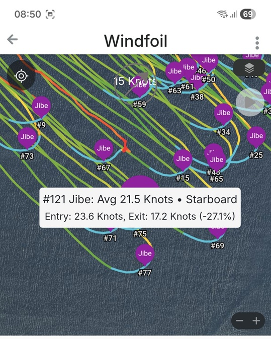
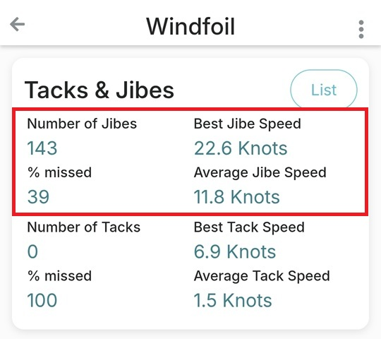
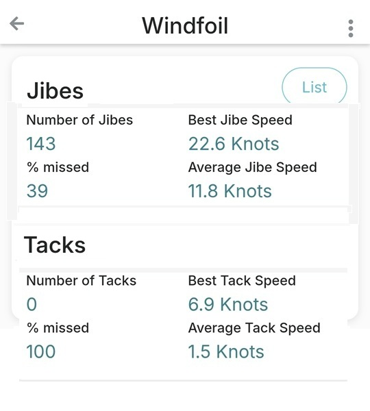

## Waterspeed Tacks & Jibes

Author: Michael George

Date created: 23 Nov 2025

### Introduction

Some generic jibe and tack metrics were discussed in an earlier document - see [link](README.md).

Some of those metrics are applicable to Waterspeed and discussed within this document.

### Individual Jibes

Individual jibes currently show the following metrics:

- Average Speed
- Entry Speed
- Exit Speed
- Disparity (%) = 1 - Exit Speed / Entry Speed

Aside from improving the choice of start / end points, some additional metrics would be appreciated:

- Min Speed
- Retained Speed (%) = Min Speed / Entry Speed
- Score (integer) = Average Speed * Retained Speed (%) * 10

Notes:

- Min Speed and Retained Speed are the key jibe metrics reported by [GpsarPro](https://gpsactionreplay.free.fr/) and [GPS Speedreader](https://github.com/prichterich/GPS-Speedreader)
- Min Speed is required to calculate Retained Speed, and Retained Speed is required to calculate the Score

### Session Summary

The session summary currently includes the four jibe metrics highlighted in red.

In addition to the Number of Jibes and % missed, it would be useful to see the following stats:

- Best Jibe Speed - already available
- Best Min Speed
- Best Retained Speed (%)
- Best Jibe Score

The concept of the best 5 gybes is also appealing to people in the Waterspeed group chat.

- 5 x Jibe Speed
- 5 x Min Speed
- 5 x Retained Speed (%)
- 5 x Jibe Score

The eight jibe metrics offer a range of different insights, each focusing on different aspects of jibing.

The existing metric "Average Jibe Speed" isn't particularly useful for windsurfing, perhaps not winging either?

Metrics for the best 5 jibes are less sensitive to patchy winds, and offer more insight than overall averages.

### Tacking

Everything discussed above also applies to tacking since all of the metrics are equally applicable.

The additional stats would make the Tacks & Jibes section rather cluttered, so probably worth splitting them apart.

This just illustrates the idea with the current stats, not showing the stats proposed earlier in this document.

